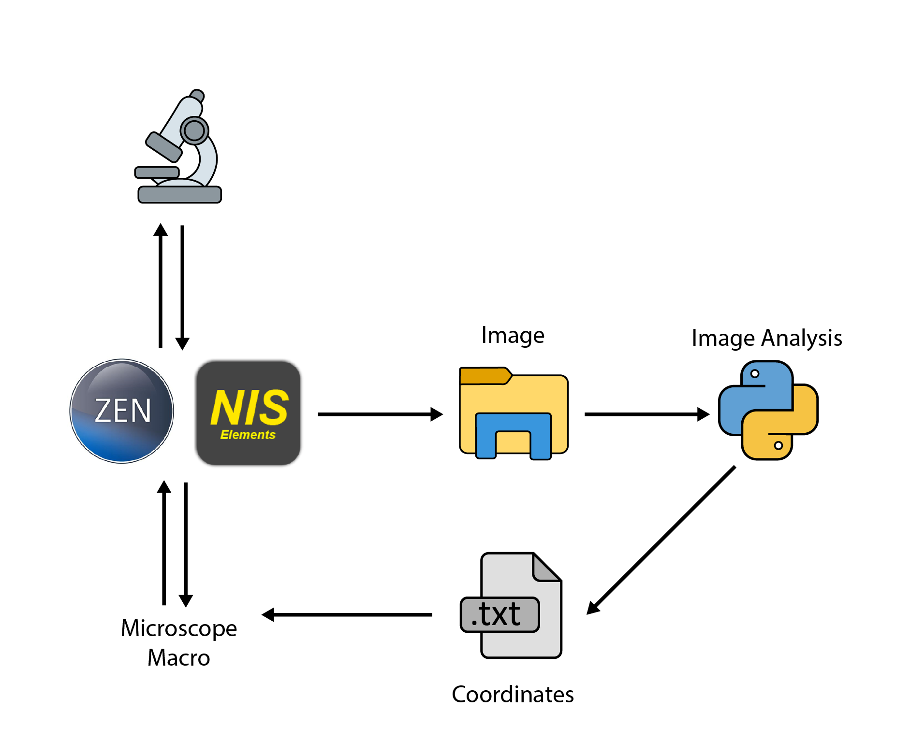
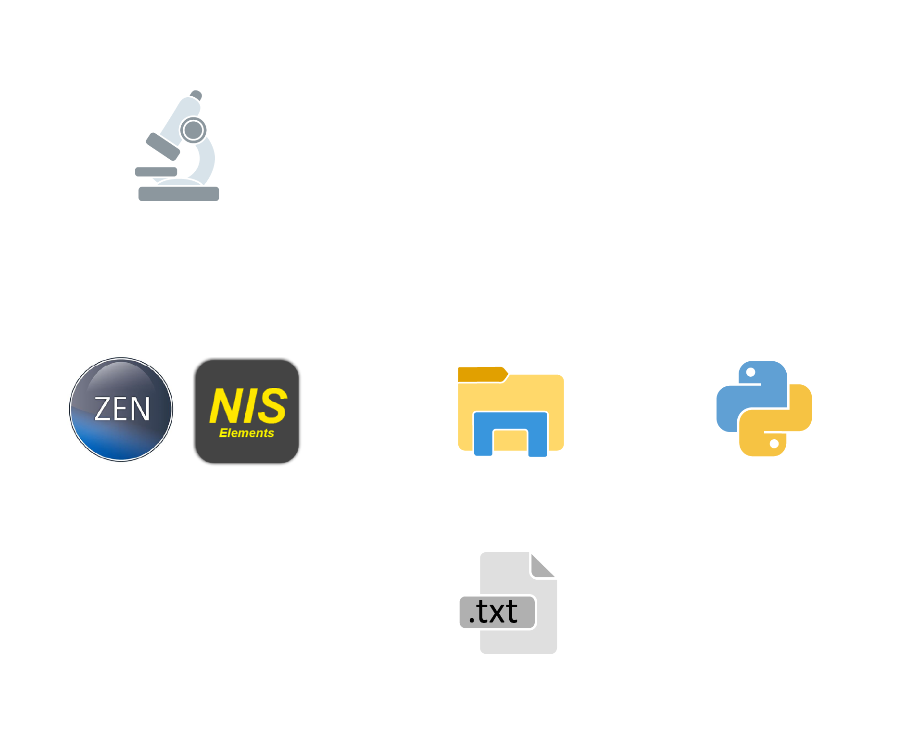

DySTrack - Dynamic Sample Tracking
==================================
|

.. image:: images/index/DySTrack.gif
   :alt: DySTrack animation
   :align: center
   :width: 800px

|

DySTrack ("diss track") is a simple automated feedback microscopy tool for live
tracking of moving samples like migrating cells or tissues.

TODO: Add a severe warning/disclaimer here

TODO: Add a short explanation/introduction here?

.. toctree::
    :maxdepth: 2

    Getting started<intro/index>

.. toctree::
    :maxdepth: 2

    Using DySTrack<usage/index>

.. toctree::
    :maxdepth: 2

    Developing DySTrack pipelines<develop/index>

.. toctree::
    :maxdepth: 2

    API Reference<api/index>

