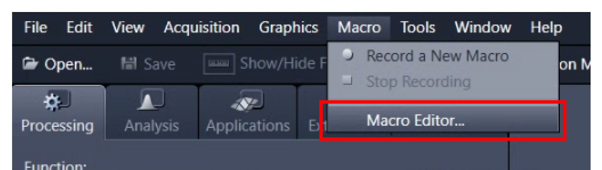

Installation
============

Broadly speaking, the following steps are required to get DySTrack running:

1. Installing software dependencies

2. Installing the DySTrack python package

3. Setting up the microscope macro / automation workflow

.. admonition:: Installation can be tricky...
    :class: tip

    Installing DySTrack is more complicated than simply using it.

    Before jumping in, be sure to familiarize yourself with 
    :doc:`how DyStrack works<howitworks>` in general and
    :doc:`how to use it</usage/index>` on your particular microscope.

    The person(s) performing the installation should be well-versed with the
    microscope in question and ideally have some experience with python and
    computers in general (though basic knowledge should be sufficient). It can 
    be useful for more than one person to work together, for example a user and
    a member of a microscope facility team.

    Also, do plan in ample time (at least a half-day) to go through all steps
    carefully and to debug any problems that crop up along the way. Since
    operating systems, microscope setups, and software versions all change
    frequently, there are many moving parts that may give rise to unexpected 
    roadblocks.

    If we might have missed something in our documentation or if something 
    seems out of date, we welcome questions and (constructive) feedback; please 
    raise an Issue `on GitHub`_. (Alas, we cannot guarantee that we will be 
    able to solve your problem or address your feedback.)

.. admonition:: Supported configurations
    :class: note

    Currently, DySTrack provides out-of-the-box support for microscopes running
    ``ZEN Black`` via `MyPiC`_ (tested on Zeiss LSM880), ``ZEN Blue`` via 
    `Macros`_ (Zeiss LSM980), or ``NIS Elements`` via `JOBS`_ (Nikon AXR).
    
    Adaptation to any other microscope control software that supports basic 
    macros/automation is also possible but requires extra work (see 
    :doc:`here</usage/other_scopes>`), and support for other systems may be 
    added in the future.

    The microscope PC's Operating System must be Windows 10 or 11.

.. _MyPiC: https://github.com/manerotoni/mypic/
.. _Macros: https://github.com/zeiss-microscopy/OAD
.. _JOBS: https://www.microscope.healthcare.nikon.com/en_EU/products/software/nis-elements/nis-elements-jobs

.. admonition:: Risk of damage
    :class: warning

    Modern microscopes are expensive machines, and automating them comes with
    an inherent risk of damage. 
    
    **Do not install DySTrack without permission from the microscope's
    administrator!**
    
    Also, be sure to test the installed setup carefully, and always ask for
    help if you are unsure about something!

Part 1: Installing software dependencies
----------------------------------------

The DySTrack manager and pipelines are written in python and shared via GitHub, 
so you need to first install python and git (git is optional but recommended).

If you are familiar with a particular python distribution, feel free to use it.
We recommend **Miniforge** for environment/package management using ``conda``, 
and we will be using it here in the documentation to explain how to install 
DySTrack. To use Miniforge, `download the Miniforge Installer here`_ and then 
follow its instructions to install it. 

.. _download the Miniforge Installer here: https://conda-forge.org/download/

The DySTrack library can be installed via pip directly from PyPI. **However**, 
since it is likely that some degree of coding (e.g. addition or modification of 
an image analysis pipeline) will be required to adapt DySTrack to your 
particular experiment of interest, we recommend using **git** to clone and 
manage the source code repository. You can 
`download the Git for Windows Installer here`_ and follow its instructions to
install it.

.. _download the Git for Windows Installer here: https://git-scm.com/install/windows

Part 2: Installing the DySTrack python package
----------------------------------------------

As mentioned above, we recommend installing DySTrack and its python 
dependencies from the GitHub source code. The following steps explain how to do
this. If you instead prefer to install via pip from PyPI, skip these steps and 
find the relevant note (blue box) at the end of this section.

2.1: Cloning the GitHub repository
..................................

(Optionally, first create your own GitHub **fork** of the DySTrack 
`Github repo`_. This is recommended if you plan to contribute improvements to 
DySTrack. If you don't know what this means, you can skip it.)

Use git to clone the DySTrack repository (or your fork of it) to a local folder
on the microscope PC:

**In Git Bash:**

.. code-block:: bash

    git clone https://github.com/WhoIsJack/DySTrack.git

2.2: Creating a python environment for DySTrack
...............................................

Using your preferred python environment/package manager, create a new
environment for DySTrack with a supported version of python (``>=3.10``) and
pip (installed automatically if using ``conda create``).

**In a Miniforge prompt:**

.. code-block:: batch

    conda create -n dystrack python=3.13

Next, ensure your environment is active:

.. code-block:: batch

    conda activate dystrack

2.3: Installing DySTrack into the environment
.............................................

With the dystrack conda environment active, use ``cd`` to change directory into 
the DySTrack git repository folder cloned during step 2.1. Then use ``pip`` to 
install DySTrack and its python dependencies:

.. code-block:: batch

    pip install -e .

This results in an "editable" install, where changes to the source code (e.g.
adding a new pipline) will be applied immediately. There is no need to 
reinstall unless changes are made to the project metadata (e.g. addition of 
dependencies to ``pyproject.toml``)

Once the installation is complete, we strongly recommend running the DySTrack
test suite to check that everything is working as intended. With the
environment still active and the working directory still being the DySTrack 
repo folder, you should be able to run the tests with this simple command:

.. code-block:: batch

    pytest

.. admonition:: Installation from PyPI
    :class: note

    If you have just installed DySTrack by going through the steps above
    (recommended), please skip this.

    If you instead want to install DySTrack from PyPI, first go back and
    complete step 2.2 to create and activate a new conda environment for
    DySTrack.

    With the new environment active, you can install from PyPI:

    .. code-block:: batch

        pip install dystrack

    To check that the install worked, run the test suite:

    .. code-block:: batch

        pytest

.. admonition:: DySTrack in Jupyter notebook
    :class: tip

    If you would like to use DySTrack from Jupyter notebook (not normally
    recommended, but it is an option), we recommend installing Jupyter notebook 
    in your base conda environment:

    .. code-block:: batch

        conda deactivate dystrack
        conda install notebook=6

    Then add your DySTrack environment as a kernel:

    .. code-block:: batch

        conda activate dystrack
        python -m ipykernel install --user --name=dystrack

    And launch Jupyter notebook from the base env:

    .. code-block:: batch

        conda deactivate dystrack
        jupyter notebook
    

Part 3: Setting up the microscope macro
---------------------------------------

The microscope macro / automation workflow handles acquisition control and 
communicates with DySTrack from within the microscope's native control 
software. Therefore, the steps here depend on the microscope/software that is 
being used.

Zeiss ZEN Blue with IronPython macro
....................................

DySTrack uses a `Zeiss OAD`_ IronPython macro to interface with ZEN Blue. 

.. _Zeiss OAD: https://github.com/zeiss-microscopy/OAD

No special installation should be required. Simply start ZEN Blue as usual and
then open the Macro editor:

If this option is not available, speak to facility staff or get in touch with
your Zeiss representative.

In the editor, find and open the DySTrack macro. It is located in the DySTrack
repository's ``macros`` folder and called ``LSM980_ZENBlue_macro.py``. 

With this, DySTrack is now ready for use in ZEN Blue. Detailed usage 
instructions are found :doc:`here</usage/zeiss_980>`.

Zeiss ZEN Black with MyPiC
..........................

DySTrack uses the `MyPiC`_ VBA macro to interface with ZEN Black. You can find
everything you need to install it in the GitHub repo, including installation
instructions in the associated `Wiki`_.

.. _MyPiC: https://github.com/manerotoni/mypic/
.. _Wiki: https://github.com/manerotoni/mypic/wiki

With MyPiC installed, DySTrack is now ready for use in ZEN Black. Detailed
usage instructions are found :doc:`here</usage/zeiss_880>`.

.. _install-NIS-JOBS:

Nikon NIS-Elements with JOBS
............................

DySTrack uses the `JOBS`_ automation suite to interface with NIS-Elements. 

.. _JOBS: https://www.microscope.healthcare.nikon.com/en_EU/products/software/nis-elements/nis-elements-jobs

Due to technical reasons, DySTrack JOBS Definitions also require a GA3 Script
as a dependency.

**Follow these steps to import the required GA3 Script:**

1. Enter the ``JOBS/GA3`` tab (at the top):

   .. image:: /images/nikon_AXR/JOBS-GA3_tab.png
       :alt: JOBS/GA3 tab screenshot
       :width: 50%

   If this option is not available, speak to facility staff or get in touch 
   with your Nikon representative.

2. Go to ``Analysis Explorer`` (middle-left):

   .. image:: /images/nikon_AXR/Analysis_explorer.png
       :alt: Analysis explorer screenshot
       :width: 40%

3. ``Create New >> Import Analysis From File...``

4. Import ``DySTrack\macros\AX_NISGA3_PointsExpose.ga3``

5. To test, double-click it and select the file 
   ``DySTrack\tests\testdata\test-pllp_AXR_prescan.tiff``
   
   The GA3 preview should run and display some numbers about the prescan file;
   ``PrescanDims`` in particular should have 8 columns (``VolumeSizeX[um]``, 
   etc.) with a single number in each.

**Next, follow these steps to import DySTrack JOBS Definitions:**

1. Go to the ``JOBS Explorer`` (next to the ``Analysis Explorer``)

   .. image:: /images/nikon_AXR/JOBS_explorer.png
       :alt: JOBS explorer screenshot
       :width: 40%

2. If necessary, create a new empty JOBS Database

3. If necessary, create a new Project (named e.g. ``DySTrack``)

4. Find the ``Import from File`` button
   It's a yellow folder icon with a yellow upwards arrow.

5. Import the desired NISJOBS ``.bin`` file(s) from ``DySTrack\macros``

   Currently, DySTrack offers two out-of-the-box JOBS Definitions (see below
   for more information). It may make sense at this point to just import both, 
   so they are available and can be inspected as examples.

You can now view and if necessary edit/customize a JOBS definition by
double-clicking on it. **We strongly recommend making a copy of an existing 
JOBS definition before trying out any modifications on it.**

.. admonition:: Out-of-the-box JOBS Definitions
    :class: note

    The DySTrack repo comes with two pre-built JOBS Definitions in the 
    ``macros`` folder:

    * ``AX_NISJOBS_lateral_line.bin``

    This definition is used for standard tracking tasks, optionally with multi-
    positioning for multiple samples. It should work for most simple 
    experiments and should be the starting point for any customized workflows.

    * ``AX_NISJOBS_chick_node.bin``

    This definition was implemented for a special case where the main scan is
    itself a tile scan. Here, a single field of view is acquired as the prescan
    (e.g. the chick node), but the subsequent main scan is a tile scan that
    covers a wider area (e.g. somitogenesis anterior of the node). This is an
    example of a slightly more advanced setup.

With the GA3 dependency and the DySTrack JOBS available, DyStrack is now ready 
for use in NIS-Elements. Detailed usage instructions are found 
:doc:`here</usage/nikon_AXR>`.

Other microscopes
.................

Currently, DySTrack only works "out of the box" on microscopes controlled with 
one of the applications listed above. 

Detailed guidance on how to implement a new macro / automation workflow to 
support another system is provided :doc:`here</usage/other_scopes>`, but note 
that this will require more time and expertise than is needed to install and 
use DySTrack on an officially supported system.

We plan to add official support for other microscopes in the future.