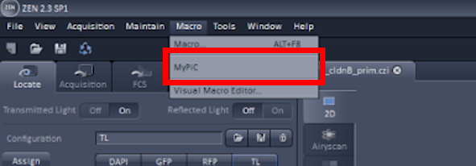
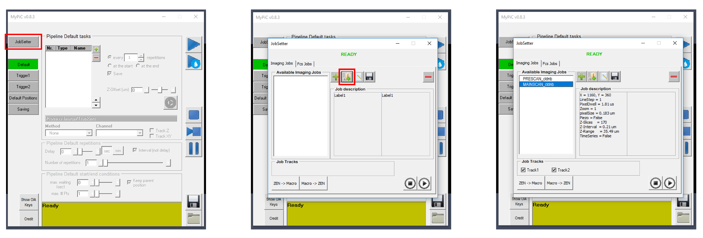
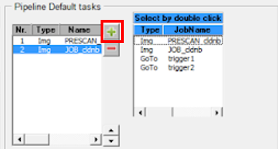
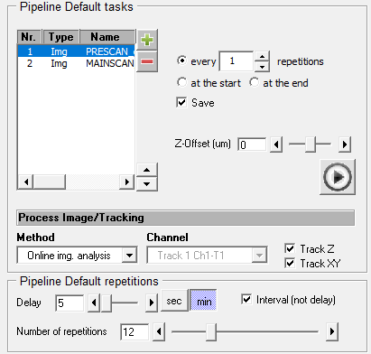

Using DySTrack on the Zeiss LSM880 (ZEN Black)
==============================================

1. Start Anaconda Prompt
--------------------------------

2. Start DySTrack environment and change direction to run folder
--------------------------------

.. code-block:: python

   conda activate DySTrack
   D:
   cd "D:\\Users\\Your Name\\DySTrack/run"

3. Start monitoring the experiment folder
--------------------------------

.. code-block:: python

   python run_lateral_line.py "D:\\Users\\Your Name\\...."

4. Make prescan and job file settings
--------------------------------

.. note::
   **Tips:**

   - Stacks must be a range around centre
   - Keep prescan low resolution and big slice size
   - To prevent bleaching, keep laser power low and use high gain
   - Save in a settings folder and not experiment folder

5. Open MyPiC in ZenBlack
--------------------------------

6. Import prescan and job files into JobSetter
--------------------------------

7. Add prescan and job settings to pipeline in the right order (prescan first)
--------------------------------

8. Set timings and image analysis on prescan file
--------------------------------

- Method: select ``Online img. analysis``
- Tick ``Track Z`` and ``Track XY``
- Tick ``Interval (not delay)`` and set how long you want the interval and how many repititions

Example:
   Every 10 mins for 12 hours → 10 min interval, 72 repetitions.

9. If using multi-positions, set your positions
--------------------------------

- Go to ``Default Positions``
- Select ``Multiple``
- ``Mark`` positions (double-check it's centred in live)

.. note:: 
   **Tip:**

   - Mark all positions with eyepiece and adjust in live.

10. Select destination folder
--------------------------------

- Use the same folder you’re monitoring in the command line.
- Tick ``.czi`` as format.

Once everything is set up, press **Play**

11. Troubleshooting
--------------------------------

- If MyPiC fails at any point, try making new prescan and job settings.
- Then try a MyPiC restart.
- Then try a full system restart.